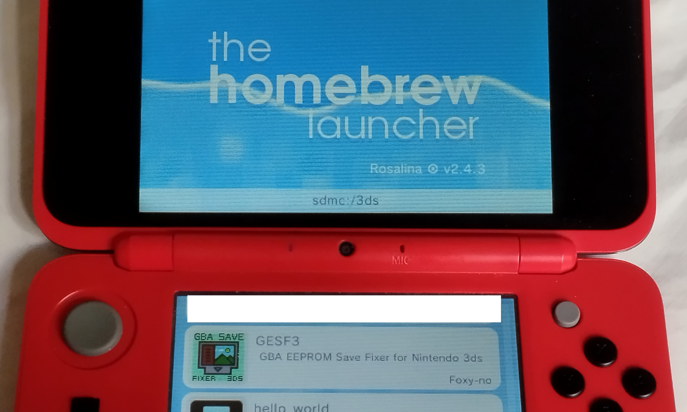
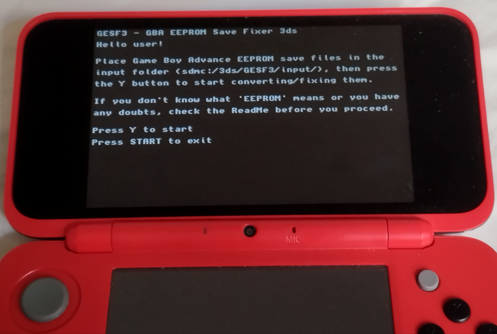
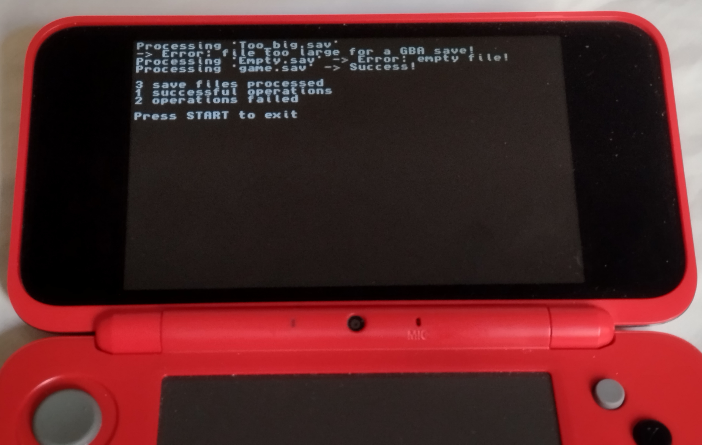
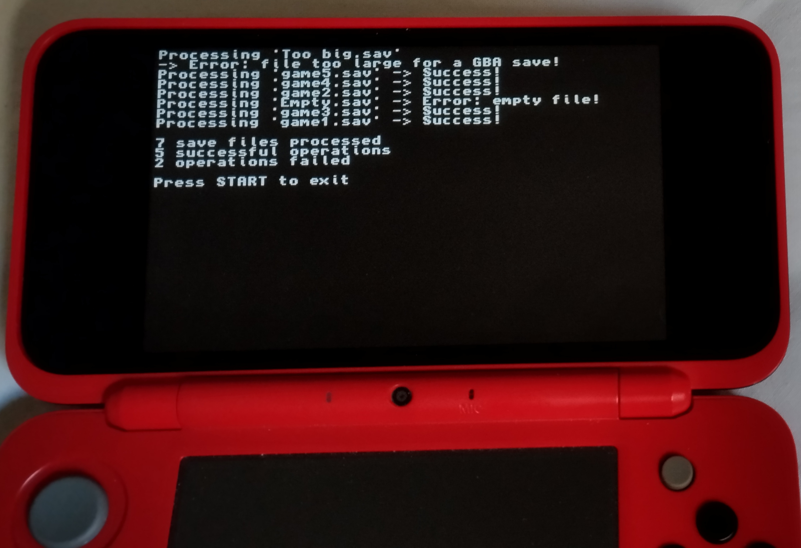
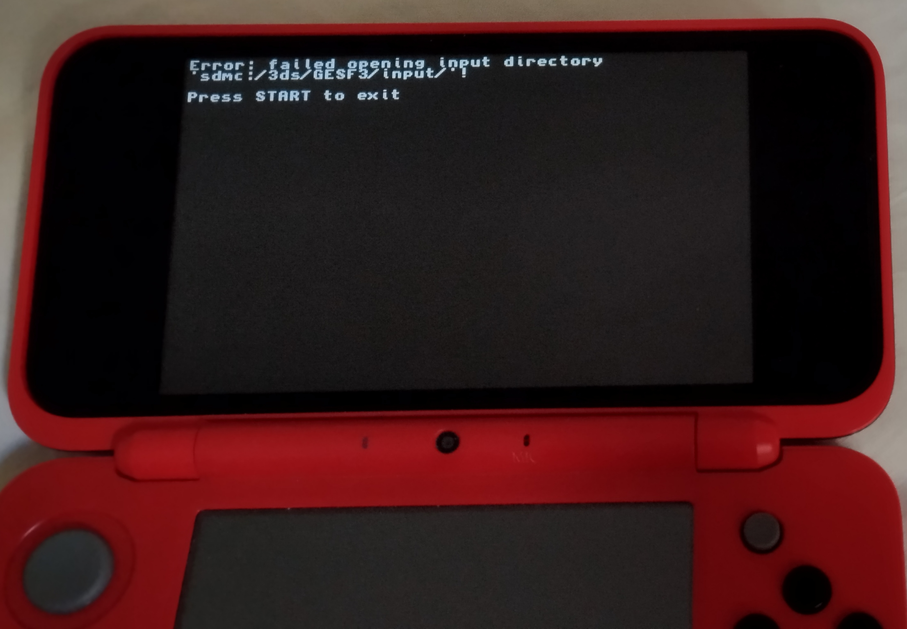
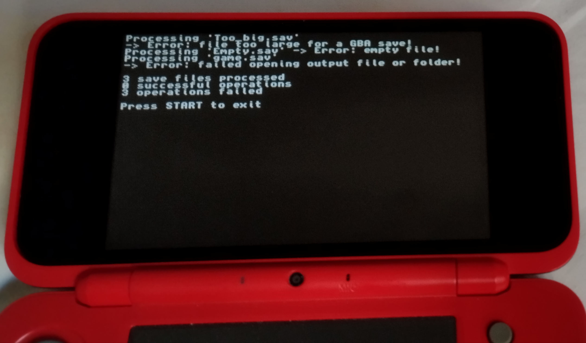
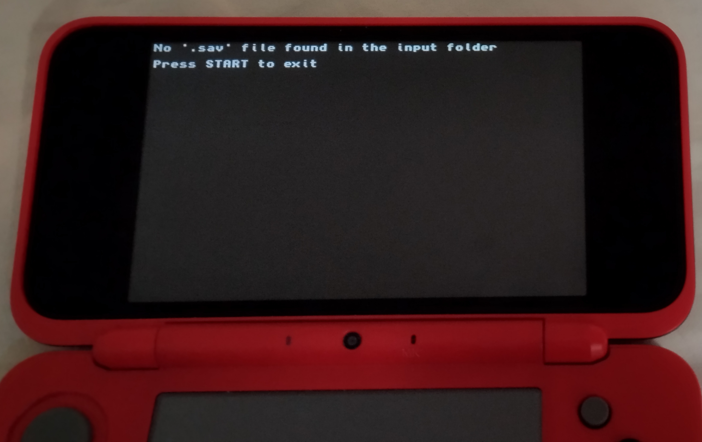

# GESF3

GBA EEPROM Save Fixer 3DS

A Nintendo 3DS homebrew utility that converts Game Boy Advance EEPROM save files between emulator format and `open_agb_firm` format.

GESF3 is a Nintendo 3DS port of `GBA EEPROM Save Fixer`, a web tool created by exelotl.

## Important

- This tool is meant to be used to convert specifically GBA EEPROM save files, *not all GBA save files*.

- If you are converting a file with a name that already exists in the output folder, it will overwrite it without asking.

## Features

- Batch processing (convert multiple save files at once)
- Automatic .sav detection
- Keeps original filenames
- Error handling
- Lightweight and offline
- Reversible conversion

## Installation

There are two easy ways to install this tool on your modded Nintendo 3DS:

1. Manual installation:<br>
Download GESF3.3dsx from the GitHub repository and copy it to `sdmc:/3ds/`.<br>
The app is now installed, you can launch it from the Homebrew Menu.

2. Universal Updater support:<br>
Install GESF3 directly from Universal Updater.<br>
The app is now installed, you can launch it from the Homebrew Menu.

Important: Before using the app you are supposed to manually create 3 folders:
- `sdmc:/3ds/GESF3/`
- `sdmc:/3ds/GESF3/input/`
- `sdmc:/3ds/GESF3/output/`

## Usage

1. Use GodMode9 to put the save files that you want to convert inside the input folder:

`sdmc:/3ds/GESF3/input/`

2. Launch GESF3 from the Homebrew Menu
3. Press Y
4. Converted saves will appear inside the output folder:

`sdmc:/3ds/GESF3/output/`

5. You can now use GodMode9 to copy the converted saves to where they can be used (either to `sdmc:/3ds/open_agb_firm/saves` or to the folder used by the emulator).

About this section

- I suggested using GodMode9 to move the save files because i think it's the most complete 3DS file browser.<br>
Any good 3DS file browser can be used instead of GodMode9.

- I suggested using a *3DS* file browser because my whole point on making this app was to be able to convert save files directly on the Nintendo 3DS.<br>
My app will work perfectly also if you use the computer to move the save files... But at that point it would probably be faster and easier to use this tool instead:<br>
https://github.com/exelotl/gba-eeprom-save-fix<br>
This webtool will convert them directly on the computer.

## Screenshots

### Menu

#### Homebrew Menu



Shown in the Homebrew Menu

#### Main menu



The main menu

---

### Processing

#### Processing 3 example files



In this picture:
- "empty.sav" is an empty test file (0 bytes)
- "Too big.sav" is not a valid GBA EEPROM save file (too large to be processed)
- "game.sav" is a normal GBA save file

#### Processing 7 example files



Example with multiple files

---

### Errors

#### Input folder error



Input folder does not exist

#### Output folder error



Output folder does not exist

#### No save file found



No '.sav' file found in the input folder

## Notes

- This is my first homebrew app.

- I made this app because<br>
I was unsure whether i preferred playing Game Boy Advance games using mGBA for 3DS or `open_agb_firm`.<br>
So i wanted to play a bit on the emulator and a bit on `open_agb_firm`, but for some games (games that used EEPROM save type) i had to 'fix' the save files whenever i wanted to switch from `open_agb_firm` to emulator or from emulator to `open_agb_firm`.<br>
The `open_agb_firm` repo linked a simple javascript tool called 'GBA EEPROM Save Fixer' that fixes those .sav files.<br>
I made GESF3 as a port of that tool to be able to fix save files when needed without using my computer at all.<br>
It is now possible to fix those save files directly on the Nintendo 3DS without removing the microSD card, thanks to GESF3 and GodMode9.

- Ideas for v2.0<br>
I would like to make it possible to do all of this without having to use GodMode9 at all (or whatever 3DS file browser, if not one built inside GESF3).<br>
I would like to make the app more user-friendly and beautiful (nicer UI)<br>
I would also like to implement a function or something capable of understanding which GBA games use EEPROM type save.<br>
If there's anything you want to ask/suggest/tell me about GESF3 in general or about v2.0, you are welcome to do it.

## FAQ

1. What is `open_agb_firm`?

It's a low-level program that allows the Nintendo 3DS to run Game Boy Advance games natively, without emulation.<br>
If you have a modded Nintendo 3DS and don't know about `open_agb_firm` by profi200, you should definitely check it out.

2. Why do I need to 'fix' save files?

You don't usually need to:
- If you always play GBA games on 3DS emulator, you are fine.
- If you always play them on `open_agb_firm`, you are also fine.
- You might want this tool only in the case you want to migrate your GBA EEPROM saves from emulator to `open_agb_firm` or vice versa.

3. Is there any chance I lose my save data using this tool?

It is very difficult to lose save data using this tool, but not 100% impossible.<br>
If you make progress in a game and you save it on a .sav file, then move (!) that save file to the output folder (!), and then you accidentally convert an older save with the same name from the input folder using GESF3. In that case you would lose your progress because the file would be overwritten... But it is very difficult to end up in this situation for at least two reasons:
- You are *never* supposed to place files in the output folder.
- You don't need to *move* the important save files to any folder. It is always more safe to *copy* them to the folders instead.<br>
And don't worry, GBA EEPROM save files shouldn't weigh more than 8 KB, they will never fill your memory.

4. What is an EEPROM save file?

EEPROM is one of the save types used by some Game Boy Advance games.<br>
All GBA games save progress in .sav files, but those files are not all the same:
- Some games use FLASH saves
- Some use SRAM saves
- Others use EEPROM saves<br>
These three types of GBA saves are completely different, but they are all in '.sav' files, so it's not super-easy to find out which type of save a GBA game uses.

5. Why is EEPROM a problem?

It is not a problem. The problem is not in the save type, the problem is that most emulators save this particular type of save files in a format that is different from the one `open_agb_firm` expects / uses.<br>
So you might want this tool on your modded 3DS to convert / fix them.

6. How to find out if a GBA game uses EEPROM type saves?

Simple but slower method:<br>
Place a GBA save file created with an emulator in the `sdmc:/3ds/open_agb_firm/saves/` folder of your modded Nintendo's microSD card and check if `open_agb_firm` reads it correctly (or do the whole thing in vice versa: test if the emulator correctly reads a save file created using `open_agb_firm`, it's the same).<br>
If it works correctly, it means this game you tested probably uses FLASH or SRAM type saves, not EEPROM. So you don't need to fix saves for this game.<br>
If the save file was not read correctly (or not read at all), it's most probably an EEPROM type save file.

Other method:
- On Unix / Linux use this code
```bash
strings game.gba | grep -E "EEPROM|SRAM|FLASH"
```
- On Windows Powershell you can probably use this code
```bash
strings game.gba | Select-String "EEPROM|SRAM|FLASH"
```

If it prints `EEPROM_V...` it means `game.gba` uses EEPROM type saves in its .sav files.<br>
If it prints 'FLASH_V...' or 'SRAM_V...', it means that you don't need to use GESF3 with the saves of this game, they will work both on emulators and on `open_agb_firm` without any conversion.

I repeat: this tool is only for save files of GBA games that use EEPROM type saves.<br>
If you convert an SRAM or FLASH save file using this tool you will create an *invalid output* save file, a save file that both `open_agb_firm` and GBA emulators are unable to read (it would be useless).<br>
I also want to specify that if you use this tool again to fix the just created invalid save file, the output save file will be exactly identical to the one you first converted, because this tool is (by its nature) fully reversible.

## License

This project is licensed under the MIT License.

## Building

Requires:
- devkitARM
- libctru

Compile with:

```bash
make
```

## Credits

The original GBA EEPROM save fixing algorithm was created by profi200:<br>
https://gist.github.com/profi200/e06794d7561ed552c518b4b0b2f5f2f6

A web port of this tool was created by exelotl:<br>
https://github.com/exelotl/gba-eeprom-save-fix

If you own a modded Nintendo 3DS, you probably already have GodMode9 installed in it. Here's the repo anyway:<br>
https://github.com/d0k3/GodMode9
